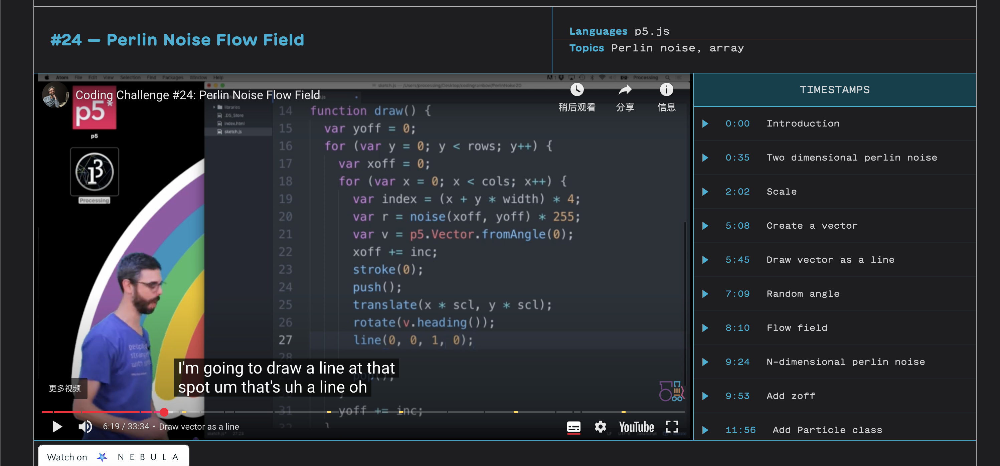

# Quiz 8 – Design Research

## Part 1: Imaging Technique Inspiration

I was inspired by the comet scene from the anime film "Your Name". In this scene, a bright comet splits across the sky, leaving behind a glowing trail that slowly dissolves into the stars. I want to incorporate this flowing light effect into my project based on Van Gogh’s “Starry Night”. Instead of a static painting, I hope to animate the brushstroke directions to mimic the motion of wind or comet trails, giving the artwork a sense of dynamic energy and emotion. This flowing motion aligns well with the swirling visual texture of the original painting.

---

## 💻 Part 2: Coding Technique Exploration

Our project is based on Van Gogh’s *Starry Night*. To recreate the visual effect of the comet streaking across the night sky in *Your Name*, I plan to use flow fields and particle systems in p5.js. A flow field generated by Perlin noise can produce smooth and organic movement paths, simulating how a comet moves through the sky. The particle system lets me control each particle’s speed, direction, and lifespan, making it possible to create a dynamic comet tail effect.

[Watch Flow Field Tutorial on YouTube](https://www.youtube.com/watch?v=BjoM9oKOAKY)
